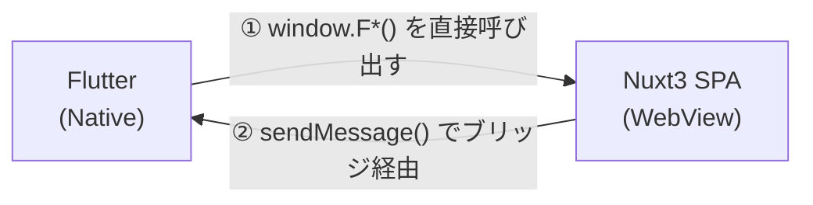

## この記事で分かること

- Flutter アプリ内の WebView で Nuxt3 SPA を動かす構成の全体像
- **Flutter → Nuxt**（Flutter が Nuxt 側の関数を呼ぶ）の実装方法
- **Nuxt → Flutter**（Nuxt が Flutter にメッセージを送る）の実装方法
- ローカル開発時に Flutter がなくても動かすフォールバック設計

対象読者：Flutter × Web のハイブリッドアプリを検討・開発しているエンジニア

---

## なぜこの構成を選ぶのか

ネイティブアプリ（Flutter）の一部画面を Web（Nuxt3）で実装すると、次のメリットがあります。

- **UI の即時更新**：アプリのリリースサイクルに縛られず、Web 側だけ更新できる
- **Web 資産の再利用**：既存の Web フロントエンドをそのまま活かせる
- **複雑なフォームや帳票**：PDF 出力や多段階フォームは Web の方が作りやすい

ただし、WebView に Web コンテンツを乗せるだけでは「ただ表示するだけ」で終わります。
実際のアプリでは、GPS の位置情報や認証トークン、プッシュ通知の受け取りなど、Flutter 側の機能と Web 側が **双方向に通信** する必要があります。

---

## 通信の全体像

この構成で難しいのは、**通信の向きによって手段がまったく異なる**点です。



| 方向 | 手段 |
|---|---|
| Flutter → Nuxt | Flutter が `window.F*()` グローバル関数を呼ぶ |
| Nuxt → Flutter | `webview-javascript-bridge` の `sendMessage()` を使う |

この2方向を分けて理解することが、この構成の核心です。

---

## Flutter → Nuxt：グローバル関数を `window` に登録する

Flutter から Nuxt の処理を呼び出したいとき、Flutter（Dart）側は WebView 上で JavaScript を直接実行します。そのため Nuxt 側が先に `window` にグローバル関数を登録しておく必要があります。

Nuxt のプラグインとして実装します。

```ts
// plugins/registerGlobalMethods.client.ts

export default defineNuxtPlugin(() => {
  const router = useRouter()
  const { setCurrentLocation } = useMapState()

  // Flutter から「戻る」を指示されたとき
  window.FGoBack = () => router.back()

  // Flutter から現在地情報が送られてきたとき
  window.FSetCurrentLocation = (location) => setCurrentLocation(location)

  // Flutter からプッシュ通知の開封を通知されたとき
  window.FOpenPushNotification = (pushId) => repository.open(Number(pushId))
})
```

Flutter 側は WebView の API を通じてこれらを呼び出します。
Nuxt 側からすると「関数を置いておくだけ」なので実装はシンプルです。

### TypeScript で `window` の型を拡張する

デフォルトでは `window.FGoBack` のような独自プロパティは型エラーになります。
型定義ファイルで `Window` を拡張して解決します。

```ts
// types/window.d.ts

export interface _Window {
  FGoBack: () => void
  FSetCurrentLocation: (location: Location) => void
  FOpenPushNotification: (pushId: string) => void
  // ... 他の関数
}

declare const window: _Window
```

これで Flutter が呼ぶ関数名と Nuxt 側の実装が型で紐づきます。
**Flutter 側との命名を揃えること**が、ここでの最大の落とし穴です。

---

## Nuxt → Flutter：ブリッジ経由でメッセージを送る

Nuxt から Flutter に処理を依頼するときは、[webview-javascript-bridge](https://pub.dev/packages/webview_javascript_bridge) を使います。

まずインストール：

```bash
yarn add webview-javascript-bridge
```

基本的な使い方はシンプルです。`sendMessage` に `action` と必要に応じて `params` を渡します。

```ts
import webViewJavaScriptBridge from 'webview-javascript-bridge'

// 返り値なし（設定を開く、スプラッシュを閉じるなど）
await webViewJavaScriptBridge.sendMessage({ action: 'openSettings' })

// 返り値あり（プラットフォームを取得するなど）
const platform = await webViewJavaScriptBridge.sendMessage<string>({
  action: 'getPlatform',
})
// 'ios' | 'android'
```

### composable にまとめて型を閉じ込める

`sendMessage` を各所から直接呼ぶと、`action` の文字列ミスや型の不整合が起きやすくなります。
すべての Flutter 通信を1つの composable にまとめるのが実践的です。

```ts
// composables/useFlutterConnection.ts

export const useFlutterConnection = () => {
  const openSettings = async () => {
    await webViewJavaScriptBridge.sendMessage({ action: 'openSettings' })
  }

  const getPlatform = async () => {
    return await webViewJavaScriptBridge.sendMessage<'ios' | 'android'>({
      action: 'getPlatform',
    })
  }

  return { openSettings, getPlatform }
}
```

呼び出し側は Flutter の存在を意識せず、composable の関数を呼ぶだけになります。

---

## 起動時の初期化フロー

アプリ起動時には、Flutter 側が保持している値（ユーザーID、認証トークン、アプリバージョンなど）を Nuxt 側のグローバル State に取り込む必要があります。

これも Nuxt プラグインで実装します。

```ts
// plugins/appSetup.client.ts

export default defineNuxtPlugin(async () => {
  const { getUserId, getAuthToken, getCurrentVersion } = useFlutterConnection()
  const { setUserId, setAuthToken, setCurrentVersion } = useLoginState()

  // Flutter から初期値を並列取得
  const [userId, authToken, version] = await Promise.all([
    getUserId(),
    getAuthToken(),
    getCurrentVersion(),
  ])

  setUserId(userId ?? 0)
  setAuthToken(authToken ?? '')
  setCurrentVersion(version ?? '')
})
```

`Promise.all` で並列取得することで、起動時の待ち時間を最小化しています。

---

## ローカル開発のフォールバック設計

Flutter がいない環境（ブラウザ、Vitest、Playwright など）では `sendMessage` は機能しません。
ここに何も対策をしないと、ローカル開発が詰みます。

`__DEBUG__` フラグで環境分岐するパターンが有効です。

```ts
export const useFlutterConnection = () => {
  const env = useRuntimeConfig().public.env
  const __DEBUG__ = ['local', 'test'].includes(env as string)

  const getPlatform = async () => {
    if (__DEBUG__) return 'ios' // ← ダミー値を返す

    return await webViewJavaScriptBridge.sendMessage<'ios' | 'android'>({
      action: 'getPlatform',
    })
  }

  const openSettings = async () => {
    if (__DEBUG__) return // ← 何もしない

    await webViewJavaScriptBridge.sendMessage({ action: 'openSettings' })
  }

  return { getPlatform, openSettings }
}
```

環境変数に `local` か `test` が指定されていれば Flutter なしで動作します。
Storybook・Vitest・Playwright それぞれで同じコードが動くのがポイントです。

:::message
`__DEBUG__` の返り値は、ローカル開発時に「通したいフロー」に合わせて調整します。
例えば GPS パーミッションが `true` を返すようにすれば、GPS 機能を含む画面もそのままテストできます。
:::

---

## まとめ

| 観点 | ポイント |
|---|---|
| 通信の向き | Flutter→Nuxt と Nuxt→Flutter で手段が異なる |
| Flutter→Nuxt | `window` にグローバル関数を登録、TypeScript で型定義を拡張 |
| Nuxt→Flutter | `webview-javascript-bridge` の `sendMessage` を composable に閉じ込める |
| 初期化 | プラグインで Flutter から初期値を `Promise.all` で並列取得 |
| 開発環境 | `__DEBUG__` フラグでダミー値にフォールバック |

この構成は日本語記事がほとんど存在しない領域ですが、Flutter × Web のハイブリッド開発は今後増えていく選択肢だと思います。同じ構成で悩んでいる方の参考になれば幸いです。

---

## 参考

- [webview_javascript_bridge (pub.dev)](https://pub.dev/packages/webview_javascript_bridge)
- [Nuxt3 Plugins](https://nuxt.com/docs/guide/directory-structure/plugins)
